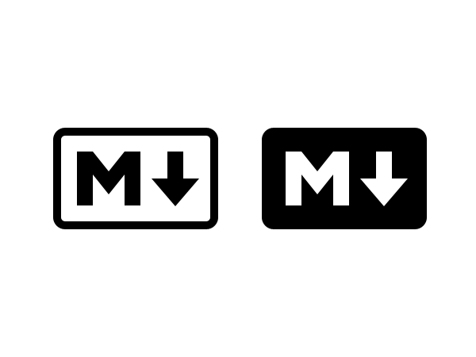

# Olá, Mundo!
 Primeiro repositorio do curso de git e github
 
 Repositorio criado durante uma live ao vivo!
 
 Essa linha eu adicionei diretamente do GitHub!

 Projeto de um site criado durante o curso de **Git e GitHub** criado no *Curso em Vídeo*

---

Eu estou apredendo a linguagem **Markdown** no **curso em vídeo do git/github**

**Negrito**

*Italico*

~~Sublinhado~~

# Título nivel 1 #

## Título nivel 2 ##

### Título nivel 3 ###

Abaixo esta um linha

---

__*Podemos misturar configurações*__

Lista numerada
1. Teste1
10. Teste2
    1. Item1
    2. Item2
100. Teste3

Lista demarcada
* Teste
* Teste
* Teste
    * Teste
    
Lista de tarefa
- [x] Criar a pagina principal
- [x] Criar a pagina da loja
- [ ] Finalizar a reunião com o cliente
- [ ] Receber pagamentento 

